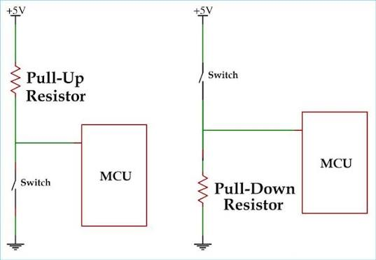
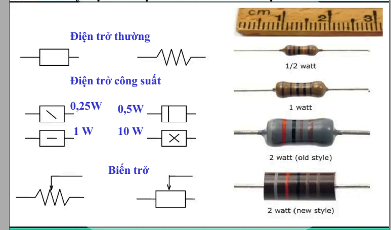
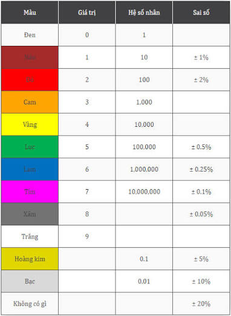
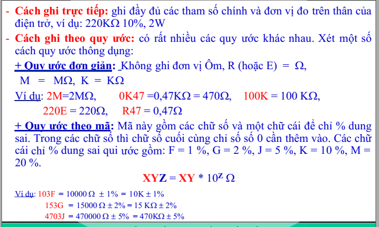
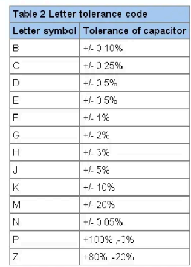
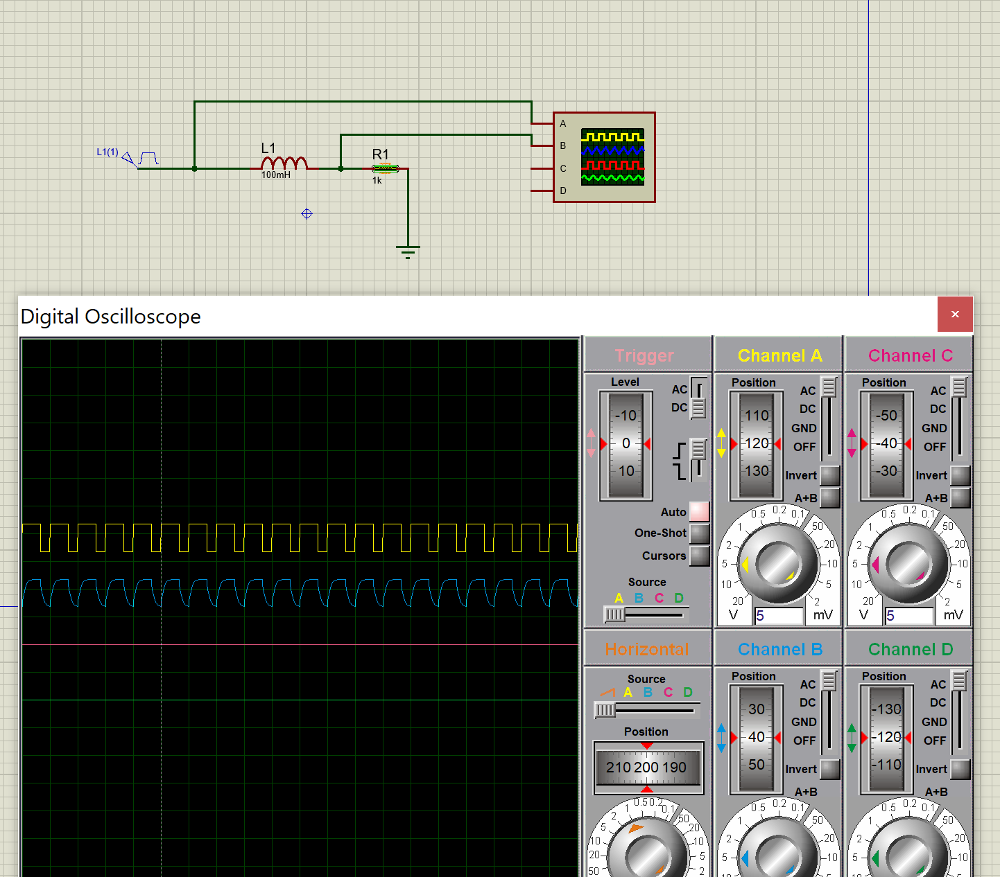
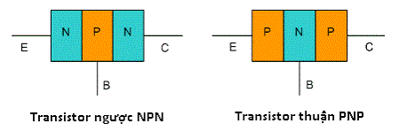

# Learning and stuff - Cau kien dien tu

### Chương 1
### Nguyên lý xếp chồng
- Áp dụng cho các mạch chứa các phần tử tuyến tính như trở, tụ, cuộn cảm
- **Nội dung: OUTPUT của mạch bằng tổng output do từng nguồn đơn lẻ gây ra khi hoạt động riêng lẻ (bất kể là dòng hay áp)**
- Quy tắc thực hiện: khi xét một nguồn tác động thì các nguồn còn lại sẽ bị triệt tiêu
    - Nguồn áp: Ngắn mạch (thay bằng dây dẫn)
    - Nguồn dòng: Hở mạch (ngắt bỏ nhánh đó)
- Kết quả e= $e_v+e_i$ 

### Biến đổi tương đương thevenin
- Giúp đơn giản hoá mạch phức tạp thành mạch tương đương gồm 2 phần tử nối tiếp
    - Gồm một nguồn Vth nối tiếp trở Rth
    - Các thông số 
        - Vth: Điện áp hở mạch tại đầu cần biến đổi 
        - In: dòng ngắn mạch tại 2 đầu đó
        - Rth: Tình bằng cthuc $$Rth = Vth/I_n$$

// add more to make it more detail

### Phương pháp phân tích mạch phi tuyến 
- Phương pháp giải hệ ptrinh bằng cách áp dụng 2 định luật Kirchoff cho dòng và áp cho các phần tử để thiết lập hệ phương trình ( thường là 2 ptrinh 2 ẩn $i_D$ và $v_D$ ) 

- Phương pháp tín hiệu nhỏ 
    - Sử dụng khi tín hiệu xoay chiều có biên độ nhỏ thay đổi xung quanh điểm làm việc một chiều
    - Quy trình 4 bước:
        - Xác định chế đố làm việc 1 chiều của mạch
        - Xác định mô hình tương đương tín hiệu nhỏ của phần tử phi tuyến tại điểm đó (Thay linh kiện phi tuyến bằng một điện trở tương đương tuyến tính)
        - Vẽ sơ đồ tương đương tín hiệu nhỏ cho toàn mạch và tính toán các thông số ($i_d, v_d$)

### Chương 2
- Note: Tóm tắt phần quan trọng của phần này chứ thấy đéo dùng mấy
- Vật liệu bán dẫn:
    - Định luật td khối: $ n.p=n_i^2 $
- Tiếp giáp P-N: 
    - Trạng thái cân bằng: không có dòng điện chạy qua
    - Phân cực thuận(V>0): Dòng điện tăng, chạy qua theo hàm mũ
    - Phân cực ngược(V<0): Dòng điện rò rất nhỏ, linh kiện coi như khoá

### Chương 3: các linh kiện cơ bản
#### Trở
Tác dụng
- Ngăn cản dòng trong mạch
- Dòng điện có xu hướng ưu tiên hướng nào có điện trở nhỏ nhất, khi dòng điện bị rẽ vd 2 nhánh, nó sẽ ưu tiên 99% điện áp vào nhánh có trở kháng nhỏ nhất 

Bonus: Từ đó đưa ra giải thích về nguyên lý trở pull-up pull down như sau

- Nguyên lý pull-down:
    - Khi cấu hình chân mcu thành input, nó đóng vai trò là 1 vôn kế cực nhạy
    - Khi nút dc bấm, dòng điện đi qua, điện áp đo được ở mức 5v ghi nhận tín hiệu cao, lúc này có dòng điện đi qua xuống gnd và điện trở đóng vai trò hạn dòng tránh dòng điện thẳng xuống gnd gây cháy
    - Khi nút ko dc bấm, vì điện áp của chân input của MCU luôn ko xác định CHỨ KHÔNG PHẢI BẰNG 0 (ở môi trg điện áp nhảy do nhiễu môi trg, từ trg các thứ) (ở môi trg giả lập thì do khi chân input ko nối với gì thì R= vô cực, không thể tính ra giá trị điện áp theo công thức V=I*R) khi đó điện trở giúp kéo và giữ điện áp chân input của mcu xuống 0 và giữ yên để chân input ghi nhận tín hiệu LOW

- Công thức liên quan
    - ĐL ohm: $U=I.R$
    - Công suất tiêu tán $$P=U\cdot I = I^2\cdot R =  \frac{U^2}{R} $$
    - Công thức cấu tạo (dùng khi thiết kế/ chế tạo): $$R = \rho \frac{l}{S} $$

- Một số khái niệm liên quan
    - Công suất danh định: là công suất tối đa điện trở chịu dc trong tgian dài
    - Điện trở cao tần (bt thêm ko bt có dùng k)
        - Ở tần số cao điện trở không thuần trở mà xuất hiện điện cảm L và điện dung C kí sinh
        - Mô hình tương đương gồm R nối tiếp L tất cả song song C
- Kí hiệu

- Cách đọc giá trị của trở 

#### Tụ điện
- Tích luỹ và lưu trữ điện tích
- Công thức tính điện: $Q=C \cdot U$

- Một số khái niệm liên quan
    - Điện áp làm việc: Mức điện áp DC tối đa tụ chịu được
    - Dòng điện rò: luôn có dòng điện dò chạy qua tụ bởi sự ko lý tưởng cảu chất cách điện
 
 - Cách đọc giá trị và kí hiệu
    - Ghi trực tiếp
    - Ghi theo quy ước số (số nguyên đvi pF, số thập phân đvi uF)
        - VD 47/630: C=47pF, $U_1c$=630Vdc
        - VD2 0.01/100: C=0.01uF, $U_1c$=100Vdc
    - Ghi theo mã XYZ=XY*$10^Z$ pF
    
        - VD 123K/50V = 12000pF + 10%, $U_1c$ = 50 Vdc
    - Quy ước màu: Tương tự điện trở, vòng màu thứ 3 là số số không thêm vào, đơn vị tính là pF

Phân loại và Ứng dụng phổ biến

- Tụ giấy, Tụ gốm (Ceramic): Rẻ, kích thước nhỏ, dùng để lọc nhiễu cao tần
- Tụ Mica: Độ ổn định cao, chịu nhiệt tốt, dùng trong mạch chính xác
- Tụ hóa (Aluminum/Tantalum): Điện dung rất lớn, dùng để lọc nguồn hoặc lưu trữ năng lượng

Ứng dụng thực tế:
- Tụ liên lạc: Cho tín hiệu AC đi qua, chặn dòng DC giữa các tầng mạch

- Tụ lọc: San phẳng điện áp sau khi chỉnh lưu

- Tụ thoát: Triệt tiêu các tín hiệu nhiễu không cần thiết xuống đất
- Mạch định thời: Kết hợp với điện trở để tạo hằng số thời gian (nạp/phóng điện)

    
#### Cuộn cảm: 
- Sinh ra hiện tượng tự cảm khi có dòng điện chạy qua 
- Note: Một chút giải thích về tác động của nó lên mạch
    
    - Có thể thấy cuộn cảm thay vì để tín hiệu lên đột ngột (đg màu vàng) thì sẽ cho tín hiệu lên 5v và xuống 0v một cách từ từ (đg màu xanh)

- Cách đọc giá trị
    - Đọc giống trở theo mã màu:
    - Vòng 1+2 trị số chính
    - V3: hệ số nhân ($10^n$)
    - V4: Dung sai 

#### Biến áp

### Chương 4: Diot

- Phương trình shockley (mối quan hệ giữa I và V): $ I=I_s\cdot(e^\frac{V}{n\cdot V_t}-1)  $
    - I: dòng qua diot
    - $I_s$ dòng điện bão hoá ngược
    - V: điện áp rơi trên diot, ở trg hợp này tg đương điện áp ngưỡng
        - diot Si: 0,5V : 0,8V
        - diot Ge: 0,2V : 0,4V
    - n: hệ số phát xạ (=1 với Ge, =2 với Si)
    - $V_t$: điện áp nhiệt ($V_t=\frac{kT}{q}$)

- Một số ứng dụng của Diot
    - Diot chỉnh lưu: Biến đổi AC thành DC qua các mạch nửa/cả chu kì
    - Diot zener hoạt động ở vùng đánh thủng ngược để giữ điện áp cố định
    - Diot có thể làm mạch như nhân đôi điện áp, mạch ghim, cắt đỉnh sóng

### Chương 5: Transistor
#### Khái niệm 

- 
- Sử dụng như một thiết bị khuếch đại hoặc khoá điện tử 

- Cấu tạo: e miền Emitter (E), Base (B), Collector (C)

- Phân loại
    - NPN: dòng điện vào B và C, ra E
    - PNP: dòng điện vào E, ra B và C

- Tiếp giáp: transistor hoạt động như 2 diot đấu lưng lại với nhau (giống diot chứ k phải có 1 con diot thật trong đấy) và dùng chung một cái ống ở giữa là chân B
    - Tiếp giáp BE hoạt động giống diot giữa chân B và E
    - Tiếp giáp BC hoạt động giống diot giữa chân B và C

    - Trạng thái tiếp giáp
        - Phân cực thuận: điện áp đúng chiều, diot cho điện đi qua

