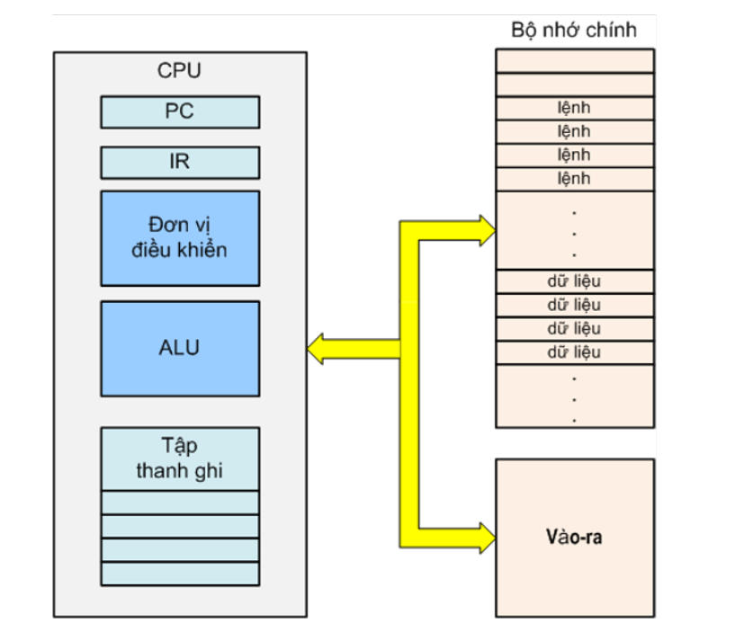
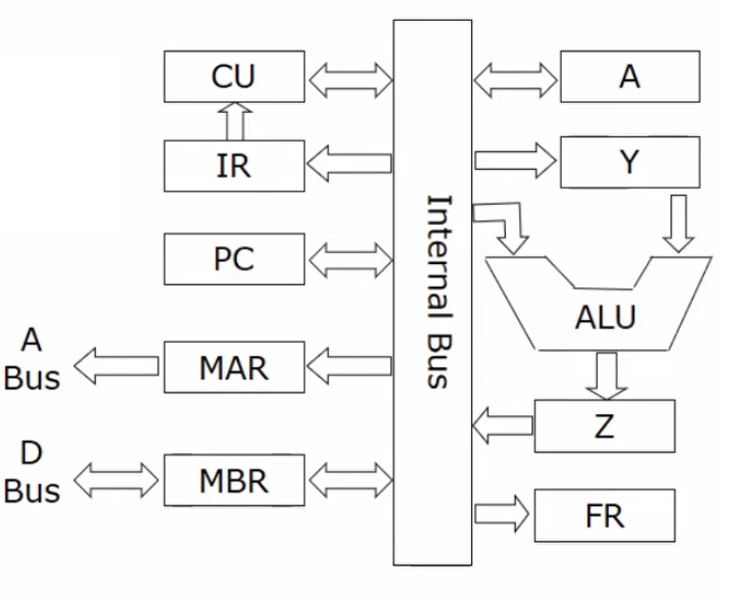

# Learning and stuff - Kiến trúc máy tính - Chương 2 Buổi 2.1
## Sơ đồ khối tổng quát của CPU
### Các thành phần cơ bản của CPU:
- Đơn vị điều khiển

## Chu kì xử lý lệnh CPU
### Khái niệm: 
- Chu kì lệnh là khoảng thời gian để CPU thực hiện xong một lệnh kể từ khi CPU cấp phát tín hiệu địa chỉ ô nhớ chứa lệnh đến khi nó hoàn tất việc thực hiện lệnh đó

### Các bước xử lý
Sơ đồ khối tổng quát 

- 1. Khi một chương trình chạy, hệ điều hành tải mã chương trình vào ram
- 2. Địa chỉ lệnh đầu tiên đc đưa vào thanh ghi PC
- 3. Địa chi ô nhớ chứa lệnh dc chuyển tới bus A qua thanh ghi MAR
- 4. Bus A truyền địa chỉ tới MMU
- 5. MMU chọn bộ nhớ và ra tín hiệu READ
- 6. Lệnh chứa trong ô dc chuyển tới thanh ghi MBR qua bus D
- 7. MBR chuyển tới IR, IR sang CU
- 8. CU giải mã lệnh và sinh ra các tín hiệu xử lý cho các đơn vị khác. : VD như bộ ALU để thực hiện cộng
- 9. Địa chỉ trong PC dc tăng lên để trỏ tới lệnh tiếp theo của phương trình sẽ dc thực hiện
- Và B3 -> B9 dc thực hiện lại để chạy hết các lệnh của chương trình

Link mô phỏng: https://colab.research.google.com/drive/1Dpss1CEsxGLYlAz2xscLPJokB7UIif6F?usp=sharing

## Các thành phần chức năng CPU
### Thanh ghi
- Là thành phần nhớ trong CPU
- Dung lượng nhỏ
- Tốc độ cao

#### Thanh ghi tích luỹ A
- Thanh ghi A có chức năng
    - Lưu trữ toán hạng đầu vào
    - Lưu kết quả đầu ra
    - Có thể dùng trao đổi dữ liệu với các thiết bị vào ra
- Kích thước = độ dài từ xử lý của CPU

#### Bộ đếm chương trình

