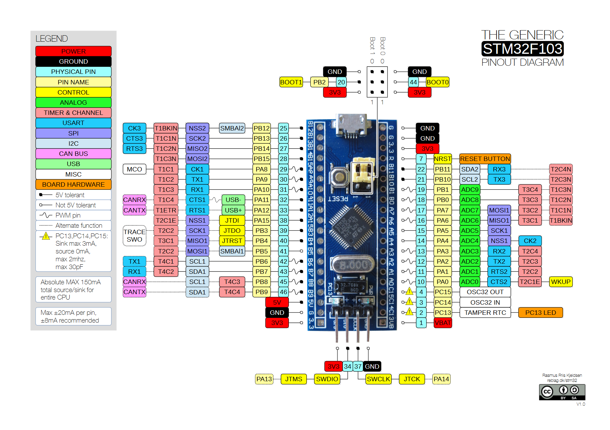
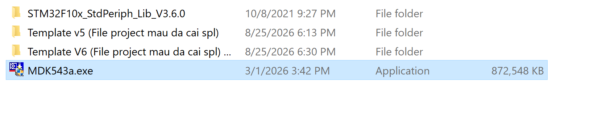
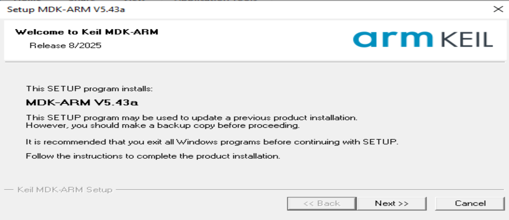
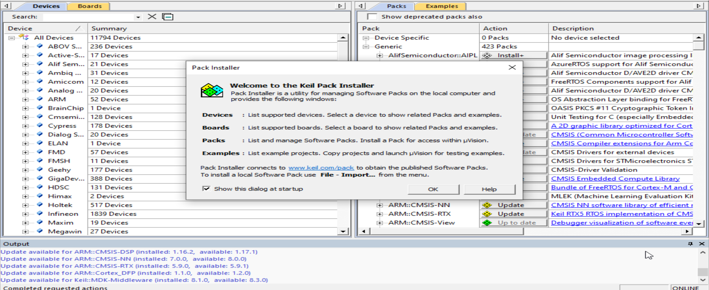
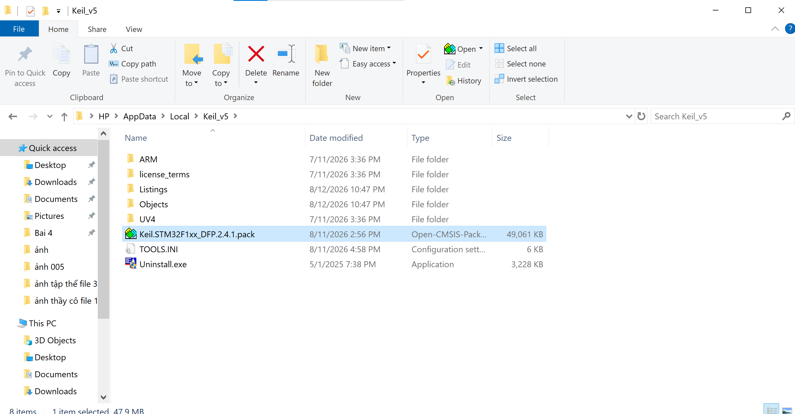

# Learning and stuff
## Bài 1 - Cài đặt Keil C, thư viện SPL

**Trước khi bắt đầu thì tải và giải nén tất cả file trong link này**

Link cai all file: https://drive.google.com/file/d/1gZiKbdJCJjsLf-40ZHMpGDjfGfiii_9v/view?usp=sharing

### Cài Keil-C

- B1: chọn file 

- B2: nháy đúp chuột và bấm "next" tới khi chương trình tải xuống 

### Tải pack
- Sau khi đã tải xong thì keil C sẽ hiện lên thư mục cài pack

- Copy file pack trong thư mục drive vừa tải, dán vào phần library như trong hình vào sau đó nháy đúp chuột vào để tải 

### Tạo project

Bước 1: Tạo Project trên KeilC và Chọn Chip
Mở phần mềm KeilC. Trên thanh menu, chọn Project -> New uVision Project...

Trỏ đường dẫn lưu tới thư mục STM32_Template mà bạn vừa tạo ở bước trước. Đặt tên file project là Template (hoặc Blink_LED) và nhấn Save.

Cửa sổ Select Device for Target hiện ra. Trong ô Search, bạn gõ STM32F103C8, chọn đúng mã chip này và nhấn OK.

LƯU Ý CỰC KỲ QUAN TRỌNG: Ngay sau đó, một cửa sổ có tên Manage Run-Time Environment sẽ hiện ra. Bạn BẮT BUỘC PHẢI BẤM CANCEL (HOẶC TẮT NÓ ĐI). Tuyệt đối không chọn gì ở đây vì chúng ta đã tự build thư viện bằng tay.

Bước 2: Nhúng file vào cây thư mục của KeilC
Dù file đã nằm trong ổ cứng, nhưng bạn phải "khai báo" thì KeilC mới biết để mang đi biên dịch.

Ở cột Project bên trái màn hình, bạn click chuột phải vào Target 1 -> chọn Manage Project Items... (hoặc bấm vào biểu tượng 3 ô vuông màu xanh đỏ trên thanh công cụ).

Tại cột giữa (Groups), bạn xóa cái Source Group 1 đi và tạo 3 nhóm mới tên là: User, CMSIS, SPL.

Tại cột phải (Files), bạn lần lượt chọn từng Group và nhấn nút Add Files... để thêm các file đã chuẩn bị vào:

Nhóm User: Add file main.c, stm32f10x_it.c.

Nhóm CMSIS: Add file system_stm32f10x.c, core_cm3.c. Tiếp theo, *chọn định dạng file là "All files (.)" hoặc "Asm Source file (*.s, .src)" để thấy và Add file startup_stm32f10x_md.s vào.

Nhóm SPL: Vào thư mục SPL\src, tạm thời Add 2 file là stm32f10x_rcc.c và stm32f10x_gpio.c (đây là 2 file bắt buộc để làm bài chớp tắt LED).

Bước 3: Trỏ đường dẫn (Include Paths) và Define lệnh
Đây là bước quyết định để KeilC tìm được các file .h.

Trên thanh công cụ, nhấn vào biểu tượng cây đũa thần Options for Target (hoặc ấn Alt + F7).

Chuyển sang tab C/C++.

Tại ô Define (ở góc trên), bạn gõ chính xác dòng này vào:
USE_STDPERIPH_DRIVER, STM32F10X_MD
(Dòng này báo cho KeilC biết bạn đang dùng thư viện SPL và dùng cho chip dòng Medium Density).

Tại ô Include Paths, bạn nhấn vào nút ... ở cuối.

Cửa sổ mới hiện ra, bạn nhấn nút New (Insert) (biểu tượng hình tờ giấy trắng) -> Nhấn vào nút ... để Browse và trỏ lần lượt đến 3 thư mục: User, CMSIS và SPL\inc.

Khi thấy có đủ 3 đường dẫn trong danh sách thì nhấn OK để đóng các cửa sổ lại.

Bước 4: Viết hàm main() và Build
Ở cây thư mục bên trái, mở Group User, nháy đúp vào file main.c để mở nó lên.

Xóa hết code mặc định (nếu có) và nhập đoạn code khung cơ bản này vào:

C
#include "stm32f10x.h"

int main(void) {
    
    while(1) {
        // Vòng lặp vô tận
    }
}
Cuối cùng, nhấn phím F7 (hoặc nút Build trên thanh công cụ).