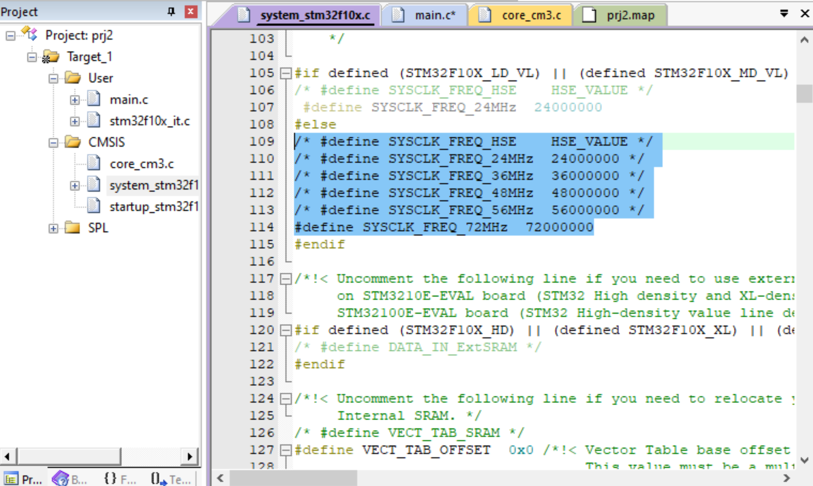

# Learning and stuff
## Bài 2: Nháy led
### 1. Tìm hiểu về port, cấp xung clock, cấu hình chân

#### 1.1 Port trong stm32f103
- STM32F103 có 3 port A, B và C, tương ứng 16 pin mỗi port

#### 1.2 Cấp clock
- Khác với esp32, stm32 và trg hợp này là dòng f1 sẽ tắt clock cho mọi port, vậy để có xung clock cần bật lên bằng lệnh sau
``` c
	RCC_APB2PeriphClockCmd(RCC_APB2Periph_GPIOA, 1);
```

- Lệnh trên có tác dụng bật clock cho port A
- Mặc định thì con f103 này sẽ chạy với tần max 72MHz, muốn đổi tần mặc định thì vào file
systemf10x.c để đổi giá trị tần số mặc định (như trong ảnh)


#### 1.3 Cấu hình GPIO

- Đầu tiên tạo 1 struct lưu thông tin chân gpio
``` c
	GPIO_InitTypeDef ChanGpioA;
```
- Sau đó đưa thông tin lần lượt như 
    - (các) pin số mấy
    - mode nào
    - tốc độ chuyển đổi giữa tín hiệu 0V và 3.3V (cái này chỉ có tác dụng khi cấu hình cho chân output, còn input thì không cần quan tâm)

``` c
    ChanGpioA.GPIO_Pin = GPIO_Pin_5 | GPIO_Pin_6 | GPIO_Pin_7;
	ChanGpioA.GPIO_Mode = GPIO_Mode_Out_PP;
	ChanGpioA.GPIO_Speed = GPIO_Speed_50MHz;
 ```

- Cuối cùng là khởi động port với địa chỉ của struct với câu lệnh
``` c
GPIO_Init(GPIOA, &ChanGpioA);
``` 
- Về GPIO_Mode có 8 mode cơ bản như sau
    - **Nhóm input:**
    - GPIO_Mode_AIN (analog Input): đọc điện áp liên tục
    - _IN_FLOATING: đầu vào thả nổi
    - IPD: Đầu vào pulldown, mạch ở 0 khi không tác động
    - IPU: Đầu vào pullup, mạch ở 1 khi ko tác động

    - **Nhóm OUTPUT**
    -  PP (Pushpull): xuất cả 2 mức 3.3V và 0V
    - OD (Open drain): Chỉ kéo tín hiệu xuống 0v, phải nối thêm pull-up res dể có mức 1, có thể giao tiếp vs mức điện áp khác 3.3v (vd 5v)
    - **Nhóm alternate**
    // tạm thời chưa dùng đến món này nên sẽ bổ sung sau

### 2. Tạo hàm delay

- Trong f103 có 1 bộ đếm tick riêng, tránh ảnh hưởng tới cpu, gọi là Systick

- Hàm SysTick_Handler(void) ở code dưới đã có sẵn trong file stm32f10x_it.c đã import ở bài trước, chỉnh sửa trực tiếp trong file đó, ở vd dưới đây hàm SysTick_Handler được đưa ra main.c cho dễ thấy


- code delay
``` volatile unsigned int count;
void startSystick(void) 
{
   SysTick_Config(SystemCoreClock / 1000);
}

void SysTick_Handler(void) // ten ham nay phai ghi y het khong dc sua ten
{
	if (count !=0) 
	{
		count--;
	}
}

void delay(unsigned int time)
{
	count = time;
	while( count != 0)
	{
		// trong nay ko lam gi vi khi delay chuong trinh k thuc hien // thu bo doan while nay di sau de xem co giong timer chay // ko
	}
}
```